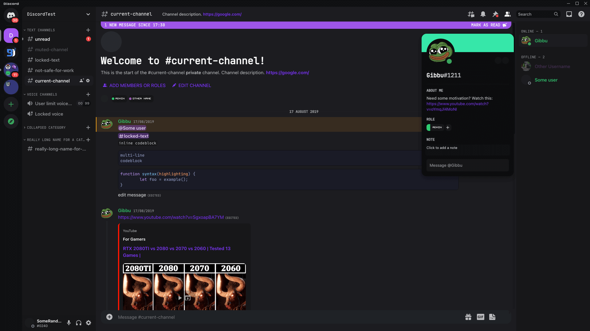

# discord-theme

My personal BetterDiscord theme.



# Environment variables

You can use the .env file to set this.

```bash
# Example (tilde doesn't seem to work)
DEPLOY_PATH="/Users/duncan/Library/Application Support/BetterDiscord/themes"
```

# Development

```bash
# First time setup
pnpm install

# Transpile the theme
pnpm run start

# Watch for changes and transpile
pnpm run dev


# Format original css file
pnpm run start --format-original
```
